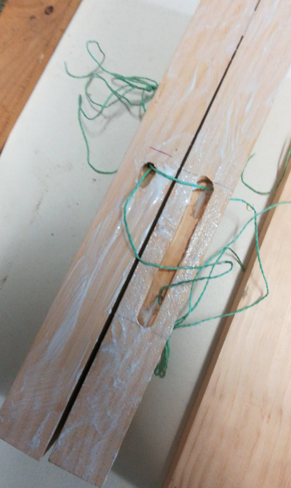

# Mitch builds a guitar

## The image in my head...

I've always had a bit of a "it'll work out in the end" kind of attitude to making things, so I usually start with the bare minimum of plans and try and adapt to the problems I come across as I come across them. But, I had a very rough idea of how I wanted this guitar to look in my head. I wanted it to be big like a jazz guitar (eg. the Gibson ES-335), and to also resemble a Gretsch Bo Diddley, but with an angular offset not unlike a Gibson Explorer or Fender Jazzmaster. I drew the roughtest of sketches, and it looks like this:

## The scope

I've built a couple of guitar necks from scratch, and frankly they're not usually worth the time. I've also built a couple of cigar-box guitars, repurposing odd bits of hardware from junk-shops and dollar stores, but I wanted this build to resemble more of a 'store bought' guitar. So, I collected a neck, and most of the hardware (except some bits and pieces I had spare in my guitar-bits box) from Aliexpress and guitarparts.co.nz.

22NZD Guitar neck from Aliexpress. Couldn't believe the value for money, frets are all dead-level and nicely crowned, which is the important bits. Couple of scuffs and some little indentations in wood, but for $22 (including shipping) I couldn't be happier.

20NZD-ish pickups from Aliexpress. Tidy appearance, no idea if they're any good, no way to tell either. Unsure whether genuine Epiphone, but it's not a particularly valuable brand so don't know why anyone would manufacture knock-offs. Proof will be in the pudding.

Bridge, machine heads ("tuners"), graphite nut, pickup selector switch and neck-plate from guitar-parts.co.nz. Decent price, only about 2 weeks shipping time, which is not bad for guitar hardware in NZ. probably a total of ~100NZD worth of parts here, the biggest expense of the project. Could have spent twice as much getting quality brand parts, but can always upgrade later.

## The build

